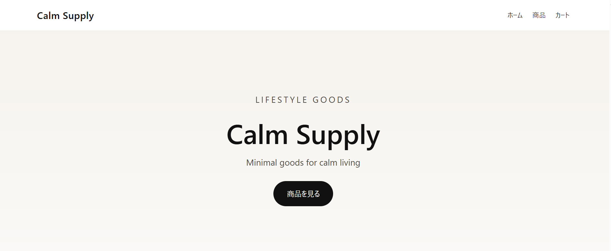

# Calm Supply – Shopifyカスタムテーマ

Shopifyのテーマ構造（Liquid）を使って作成した、ミニマルなオンラインストアです。  
商品一覧、商品ページ、カート機能など、ECサイトの基本機能を自作テーマで実装しています。

---

## デモストア

ストアURL  
https://yuuma-shop.myshopify.com

閲覧パスワード  
calmshop

---

## 概要

「Calm Supply」は、シンプルな生活雑貨を扱うオンラインストアを想定したデモサイトです。  

Shopifyの既存テーマを使わず、テーマ構造を理解する目的で  
Liquid・HTML・CSS・JavaScriptを使って実装しました。

---

## 実装した機能

- Shopifyカスタムテーマ作成
- 商品一覧ページ
- 商品詳細ページ
- カート機能（追加・削除）
- レスポンシブデザイン
- ミニマルなUIデザイン

---

## 使用技術

- Shopify Liquid
- HTML
- CSS
- JavaScript

---

## テーマ構成

assets/
config/
layout/
sections/
snippets/
templates/

---

## 作者

Yuuma
